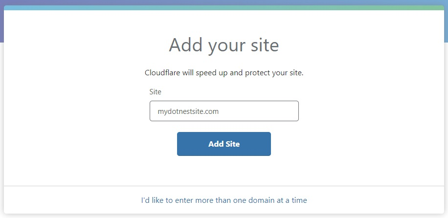
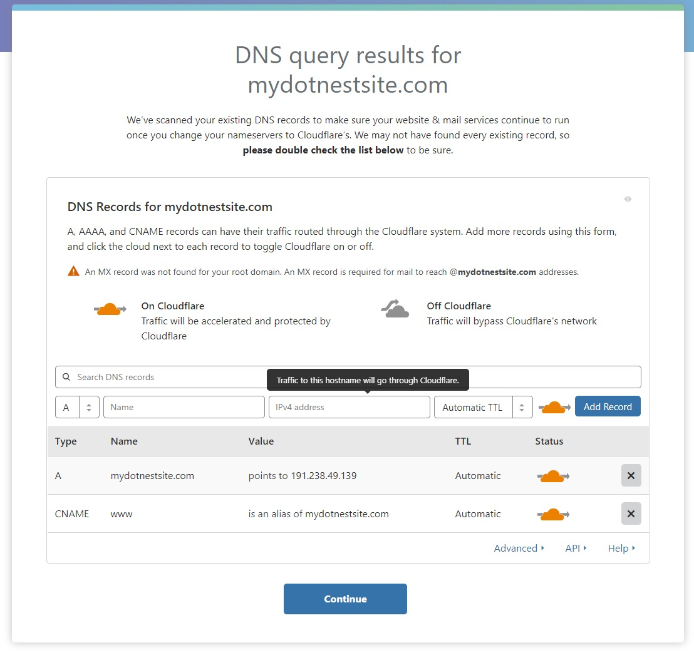

# Using a custom domain name with DotNest

On DotNest you can use your custom domain name with your site too instead of the default mysite.dotnest.com form. To use this feature you have to do the following:

1. Buy a domain name at a domain registrar. We use and recommend [Namecheap](https://www.namecheap.com/domains/registration.aspx?aff=87219).
2. Configure the domain to use it with DotNest. For this you need to use the admin panel your domain registrator provides you and configure domains the following way (make sure to wait up to a few hours for such changes to propagate through the domain name system):
	- For second-level domains (i.e. if you want to use something like mydomain.com for your website) set the IP of the domain A record to 191.238.49.139. This is the standard way to do it, so you have to include this IP in your domain record (what is unfortunate because we may change this IP if it's inevitable). To overcome this you could use services that offer CNAME-like functionality at the root record, so you can point mydomain.com to your DotNest subdomain (e.g. mysite.dotnest.com) instead (such services are available from [DNSimple](http://support.dnsimple.com/articles/alias-record), [DNS Made Easy](http://www.dnsmadeeasy.com/services/aname-records/) and [easyDNS](http://docs.easydns.com/aname-records/) for example).
	- If you use a second-level domain make sure to set the www subdomain (e.g. www.mydomain.com) as a CNAME to your second-level domain. Note that DotNest sites can only have www-less domains: a request to the www version will be redirected to the www-less one.
	- For lower-level domains (like blog.mydomain.com) set the CNAME record to the default DotNest subdomain of your site (e.g. mysite.dotnest.com).
3. Configure your custom domain on DotNest for your site from under [the site management page](https://dotnest.com/DotNest.Frontend/UserSiteManagement/). Note that custom domain usage is subject to a fee, see [pricing details](https://dotnest.com/pricing).

Your site now should listen to your custom domain, enjoy!

Once you set up your custom domain any requests to the standard DotNest subdomain will be redirected to your custom domain (i.e. if users open your site with the old mysite.dotnest.com address then they will get redirected to mydomain.com). Exception is a secure request: if the request goes through SSL to your site then that won't get redirected. The reason is that SSL is not available for custom domains out of the box so this way you can still administer your site securely. However you can still secure your site under a custom domain, see below.

## Using SSL (HTTPS) with your custom domain

Out of the box DotNest doesn't offer secure SSL (HTTPS) connections to sites under a custom domain. However you can easily secure your website with [Cloudflare](https://www.cloudflare.com/) for free as following (you only need to do this for your custom domain, your default mysite.dotnest.com is automatically protected!). As an added benefit you'll also get some further features from Cloudflare, like visitor statistics and a firewall, or even perks like automatic obfuscation of e-mail addresses visible on the site (so spambots can't gather them).

1. Sign up on [Cloudflare](https://www.cloudflare.com/) if you don't yet have an account.
2. Select to add a site and use your custom domain name.

3. Follow the instructions, but select the Free plan (unless you want to have the premium features of course, but for basic SSL the Free plan is enough).
4. Allow web traffic to go through Cloudflare for your site. This will allow Cloudflare to supply and SSL certificate for your website.

5. Continue following the instructions to change your domain's nameservers.
6. Once the nameserver changes have been propagates and your site is being served through Cloudflare SSL access will just magically work! You'll be able to visit https://mydotnestsite.com and you shouldn't get any errors. All the default settings provided by Cloudflare are suitable and you don't need to change anything; however one thing we recommend is to turn "Always use HTTPS" on under Crypto settings (so non-HTTPS requests get redirected), possibly also HSTS. The SSL certificate will be automatically renewed, so nothing else for you to do.